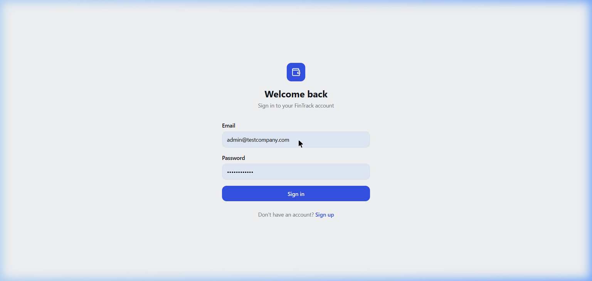
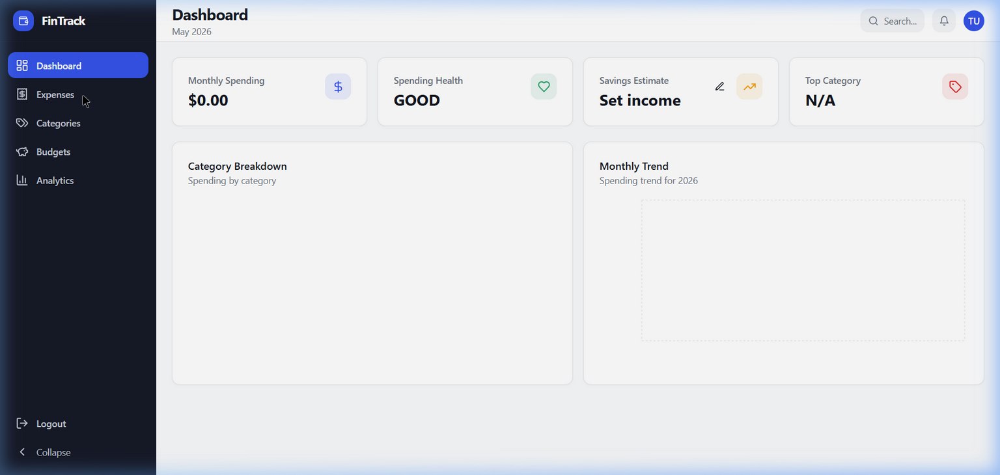
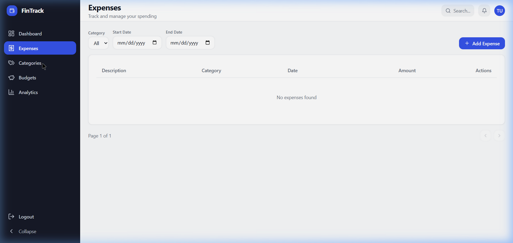
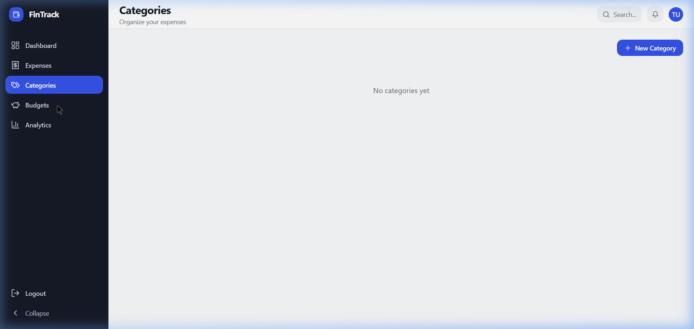
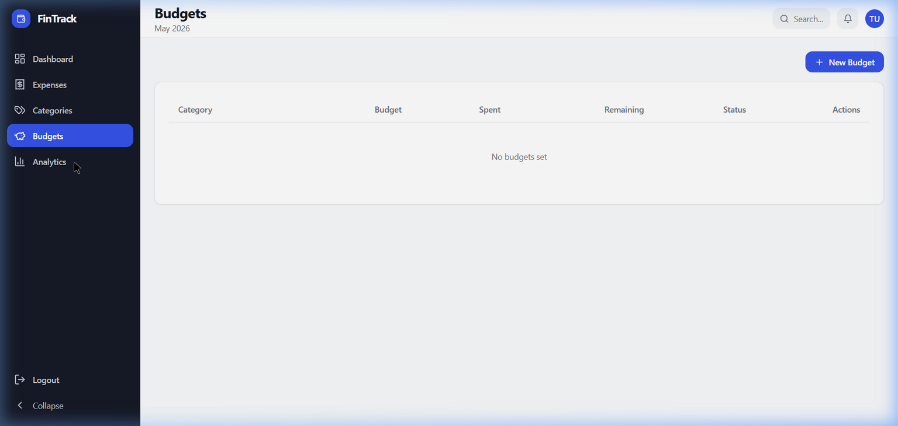

<div align="center">

# 💰 FinTrack

### A full-stack personal finance management application

[](https://openjdk.org/)
[](https://spring.io/projects/spring-boot)
[](https://react.dev/)
[](https://www.typescriptlang.org/)
[](https://www.postgresql.org/)
[](https://docs.docker.com/compose/)

**Track expenses · Manage budgets · Visualize spending · Stay on top of your finances**

</div>

---

## 📋 Table of Contents

- [Overview](#-overview)
- [Features](#-features)
- [Tech Stack](#-tech-stack)
- [Architecture](#-architecture)
- [Screenshots](#-screenshots)
- [API Reference](#-api-reference)
- [Local Setup](#-local-setup)
- [Testing](#-testing)
- [Project Structure](#-project-structure)
- [Security Design](#-security-design)
- [Future Improvements](#-future-improvements)

---

## 🌟 Overview

**FinTrack** is a production-grade personal finance tracker built with a **Spring Boot REST API** backend and a **React + TypeScript** dashboard frontend. It lets users register, log in, track day-to-day expenses, set monthly budgets by category, and view rich analytics — all behind JWT-secured endpoints.

> Built as a portfolio project demonstrating full-stack engineering: API design, JWT authentication, role-based access control, backend validation, unit testing, and a modern frontend dashboard with charts.

---

## ✨ Features

| Area | What it does |
|------|-------------|
| 🔐 **Authentication** | JWT-based registration & login; BCrypt password hashing |
| 💸 **Expense Management** | Create, read, update, delete expenses with category, date, and pagination filters |
| 🏷️ **Category Management** | Per-user custom categories; full CRUD |
| 📊 **Budget Tracking** | Monthly budget creation & editing; real-time budget summary with overspending detection |
| 📈 **Analytics** | Monthly total, top category, category breakdown, monthly trend, spending health, savings estimate |
| 🛡️ **Role-Based Access** | `USER` and `ADMIN` roles; admin-only endpoints for user management |
| ✅ **Validation & Errors** | Bean Validation on all inputs; global exception handler with consistent error format |
| 🔒 **Optimistic Locking** | Stale-update conflict detection on expense edits |
| 📄 **API Docs** | Live Swagger UI (springdoc-openapi) |
| 🐳 **Docker Support** | Docker Compose for one-command PostgreSQL + backend startup |

---

## 🛠️ Tech Stack

### Backend
| Technology | Purpose |
|------------|---------|
| **Java 21** | Core language (Records, Sealed classes, Pattern matching) |
| **Spring Boot 3.5** | Application framework |
| **Spring Security 6** | Authentication & authorization filter chain |
| **JJWT 0.11.5** | JWT token creation & validation |
| **Spring Data JPA / Hibernate** | ORM and database access layer |
| **PostgreSQL** | Primary relational database |
| **Bean Validation (Jakarta)** | Request-level input validation |
| **springdoc-openapi 2.x** | Auto-generated Swagger UI |
| **Lombok** | Boilerplate reduction |
| **JUnit 5 + Mockito + MockMvc** | Unit and controller tests (26 tests) |

### Frontend
| Technology | Purpose |
|------------|---------|
| **React 18** | UI component library |
| **TypeScript** | Type-safe frontend code |
| **Vite** | Lightning-fast dev server & bundler |
| **Tailwind CSS** | Utility-first styling |
| **shadcn/ui** | Accessible, pre-built component system |
| **Recharts** | Expense charts (pie, bar, line) |
| **Axios** | HTTP client with JWT interceptors |
| **Vitest** | Frontend unit tests |

---

## 🏗️ Architecture

```
┌─────────────────────────────────────────────────────────────────┐
│                        CLIENT BROWSER                           │
│                   React + TypeScript (Vite)                     │
│          Dashboard · Expenses · Categories · Budgets            │
│                     Analytics · Auth Pages                      │
└──────────────────────────┬──────────────────────────────────────┘
                           │ HTTPS / REST (Axios + JWT Bearer)
                           ▼
┌─────────────────────────────────────────────────────────────────┐
│                    SPRING BOOT 3 BACKEND                        │
│                                                                 │
│  ┌─────────────┐   ┌──────────────────┐   ┌─────────────────┐ │
│  │   Security  │   │   Controllers    │   │    Services     │ │
│  │  JWT Filter │──▶│  REST Endpoints  │──▶│  Business Logic │ │
│  │  CORS Config│   │  Bean Validation │   │  Analytics      │ │
│  └─────────────┘   └──────────────────┘   └────────┬────────┘ │
│                                                     │          │
│  ┌──────────────────────────────────────────────────▼────────┐ │
│  │              Spring Data JPA / Hibernate                  │ │
│  │         User · Expense · Category · Budget entities       │ │
│  └──────────────────────────┬─────────────────────────────── ┘ │
└─────────────────────────────┼───────────────────────────────────┘
                              │ JDBC
                              ▼
                  ┌───────────────────────┐
                  │      PostgreSQL        │
                  │  (Docker or managed)   │
                  └───────────────────────┘
```

**Request flow:**
1. React frontend sends HTTP requests with `Authorization: Bearer <token>` header
2. `JwtAuthenticationFilter` validates the token and sets the Spring Security context
3. Controllers receive validated input, delegate to Service layer
4. Services apply business logic and access the database via JPA Repositories
5. Global `@RestControllerAdvice` handles all exceptions and returns consistent JSON error responses

---

## 📸 Screenshots

### Login


### Dashboard
> Live summary cards — monthly spending, spending health, savings estimate (editable income), and top spending category. Includes category breakdown pie chart and monthly trend line chart.



### Expenses
> Full expense list with category filter, date range filter, pagination, and inline edit/delete.



### Categories
> User-defined expense categories — create, rename, and delete.



### Budgets
> Monthly budget management — set budgets per category, track spent vs. remaining, spot overspending.



---

## 📡 API Reference

Full interactive documentation available at **`http://localhost:8080/swagger-ui/index.html`** when running locally.

<details>
<summary><strong>Auth Endpoints</strong></summary>

| Method | Endpoint | Description | Auth |
|--------|----------|-------------|------|
| `POST` | `/api/user/register` | Register a new user | ❌ Public |
| `POST` | `/api/user/login` | Login, returns JWT token | ❌ Public |

</details>

<details>
<summary><strong>Expense Endpoints</strong></summary>

| Method | Endpoint | Description | Auth |
|--------|----------|-------------|------|
| `POST` | `/api/expenses` | Create an expense | ✅ JWT |
| `GET` | `/api/expenses` | List expenses (category, date, pagination filters) | ✅ JWT |
| `GET` | `/api/expenses/{id}` | Get expense by ID | ✅ JWT |
| `PUT` | `/api/expenses/{id}` | Update expense (optimistic locking) | ✅ JWT |
| `DELETE` | `/api/expenses/{id}` | Delete expense | ✅ JWT |

</details>

<details>
<summary><strong>Category Endpoints</strong></summary>

| Method | Endpoint | Description | Auth |
|--------|----------|-------------|------|
| `POST` | `/api/category/create` | Create a category | ✅ JWT |
| `GET` | `/api/category` | List user's categories | ✅ JWT |
| `PUT` | `/api/category/{id}` | Update category | ✅ JWT |
| `DELETE` | `/api/category/{id}` | Delete category | ✅ JWT |

</details>

<details>
<summary><strong>Budget Endpoints</strong></summary>

| Method | Endpoint | Description | Auth |
|--------|----------|-------------|------|
| `POST` | `/api/budgets` | Create a budget | ✅ JWT |
| `PUT` | `/api/budgets/{id}` | Update a budget | ✅ JWT |
| `GET` | `/api/budgets/summary` | Get budget summary for current month | ✅ JWT |

</details>

<details>
<summary><strong>Analytics Endpoints</strong></summary>

| Method | Endpoint | Description | Auth |
|--------|----------|-------------|------|
| `GET` | `/analytics/analytics/monthly-total` | Total spending this month | ✅ JWT |
| `GET` | `/analytics/category-breakdown` | Spending split by category | ✅ JWT |
| `GET` | `/analytics/top-category` | Highest spending category | ✅ JWT |
| `GET` | `/analytics/monthly-trend` | Month-over-month trend | ✅ JWT |
| `GET` | `/analytics/spending-health` | Health status (GOOD / WARNING / CRITICAL) | ✅ JWT |
| `GET` | `/analytics/overspending` | Categories over budget | ✅ JWT |
| `GET` | `/analytics/savings-estimate` | Savings estimate given monthly income | ✅ JWT |

</details>

<details>
<summary><strong>Admin Endpoints</strong></summary>

| Method | Endpoint | Description | Auth |
|--------|----------|-------------|------|
| `PATCH` | `/api/admin/users/{id}/promote` | Promote user to ADMIN role | ✅ ADMIN only |
| `GET` | `/api/admin/test` | Health check for admin access | ✅ ADMIN only |

</details>

### Sample API Response Format

```json
// Success
{
  "status": 200,
  "message": "Expense created successfully",
  "data": { "id": 1, "description": "Groceries", "amount": 450.00, "date": "2026-05-10" }
}

// Error
{
  "status": 400,
  "messages": ["Amount must be greater than 0", "Category is required"],
  "timestamp": "2026-05-10T13:00:00"
}
```

---

## 🚀 Local Setup

### Prerequisites

- **Java 21** — [Download](https://adoptium.net/)
- **Node.js 18+** — [Download](https://nodejs.org/)
- **Docker Desktop** — [Download](https://www.docker.com/products/docker-desktop/) *(for PostgreSQL)*
- **Git**

### 1. Clone the Repository

```bash
git clone https://github.com/Satyamkumarputhal/Fintrack.git
cd Fintrack
```

### 2. Configure Environment Variables

```bash
# Copy the example env file
cp .env.example .env
```

Edit `.env` and set your values:

```env
DB_URL=jdbc:postgresql://localhost:5432/fintrack
DB_USERNAME=postgres
DB_PASSWORD=your_password
JWT_SECRET=your_super_secret_jwt_key_min_32_chars
```

### 3. Start PostgreSQL (Docker)

```bash
docker compose up -d postgres
```

### 4. Run the Backend

```bash
# Windows
.\mvnw.cmd spring-boot:run

# Linux / macOS
./mvnw spring-boot:run
```

Backend starts at **`http://localhost:8080`**

> 📄 Swagger UI: `http://localhost:8080/swagger-ui/index.html`

### 5. Run the Frontend

```bash
cd finflow-dashboard
npm install
npm run dev
```

Frontend starts at **`http://localhost:5173`**

---

## 🧪 Testing

### Backend Tests (26 tests)

```bash
.\mvnw.cmd test          # Windows
./mvnw test              # Linux/macOS
```

Test coverage includes:
- ✅ Service layer unit tests (Mockito)
- ✅ Controller tests via MockMvc
- ✅ JWT filter & security tests
- ✅ Request validation tests
- ✅ Global exception handler tests

### Frontend

```bash
cd finflow-dashboard

npm run lint      # ESLint — 0 errors
npm run test      # Vitest
npm run build     # Production build validation
```

---

## 📁 Project Structure

```
fintrack/
│
├── src/                                    # Spring Boot backend
│   └── main/java/com/satyam/fintrack/
│       ├── Security/                       # JWT filter, token service
│       ├── config/                         # CORS, Security config, OpenAPI
│       ├── controller/                     # REST controllers
│       ├── dto/                            # Request/Response DTOs
│       ├── entity/                         # JPA entities (User, Expense, Category, Budget)
│       ├── exceptions/                     # Custom exceptions + GlobalExceptionHandler
│       ├── repository/                     # Spring Data JPA repositories
│       ├── scheduler/                      # Scheduled tasks
│       └── service/                        # Business logic
│
├── finflow-dashboard/                      # React frontend (separate Git repo)
│   └── src/
│       ├── api/                            # Axios instance + interceptors
│       ├── components/                     # Reusable UI components
│       ├── context/                        # Auth context (JWT state)
│       ├── pages/                          # Dashboard, Expenses, Categories, Budgets, Analytics
│       └── services/                       # API service functions
│
├── docs/screenshots/                       # App screenshots for documentation
├── docker-compose.yml                      # PostgreSQL + backend Docker setup
├── pom.xml                                 # Maven build config
└── .env.example                            # Environment variable template
```

---

## 🔐 Security Design

| Concern | Implementation |
|---------|---------------|
| **Password Storage** | BCrypt hashing via Spring Security `PasswordEncoder` |
| **Authentication** | Stateless JWT; token validated on every request via `JwtAuthenticationFilter` |
| **Authorization** | Method + URL security; `ADMIN` role required for `/api/admin/**` |
| **CORS** | Configured via `CorsConfig` — only allowed origins can make requests |
| **Input Validation** | Jakarta Bean Validation annotations on all DTOs |
| **Error Responses** | Consistent JSON format: `status`, `messages`, `timestamp` |
| **Optimistic Locking** | `@Version` field on `Expense` entity prevents stale writes |

---

## 🔮 Future Improvements

- [ ] Persist monthly income in backend user settings (currently browser localStorage)
- [ ] Refresh token flow for seamless session renewal
- [ ] Docker Compose profile for one-command full-stack startup
- [ ] Integration tests with Testcontainers
- [ ] GitHub Actions CI — auto-run backend & frontend checks on every push
- [ ] Email notifications for budget overruns
- [ ] Export expenses as CSV / PDF

---

<div align="center">

Built with ☕ Java, ⚛️ React, and 🐘 PostgreSQL

**[Satyam Kumar Puthal](https://github.com/Satyamkumarputhal)**

</div>
